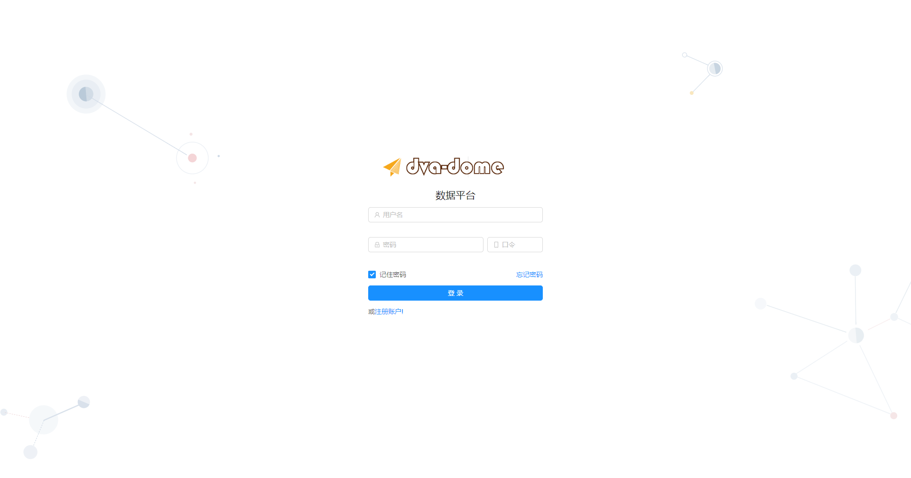
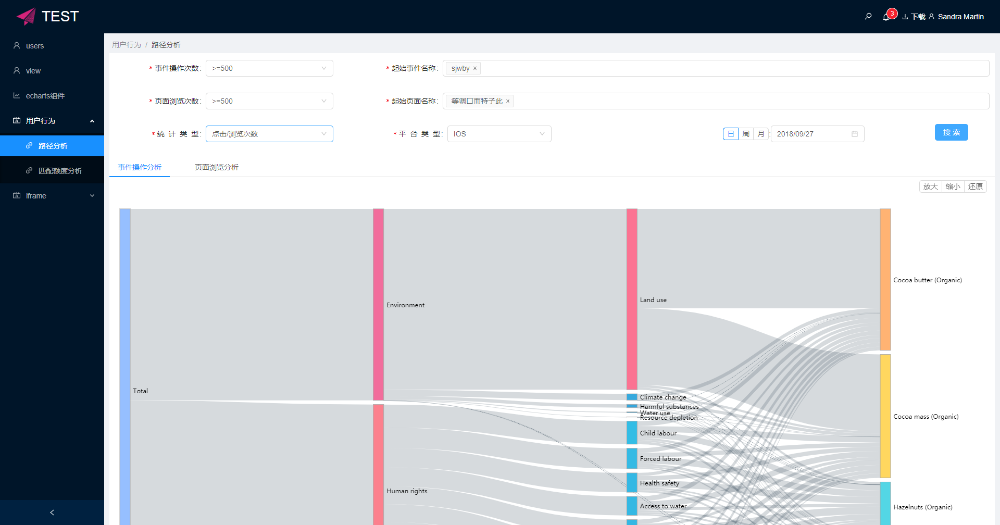
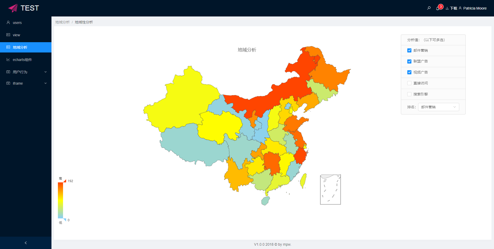
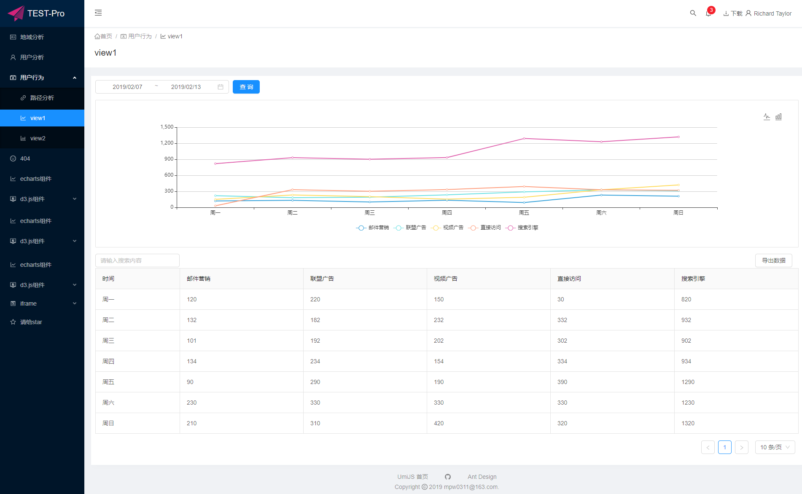
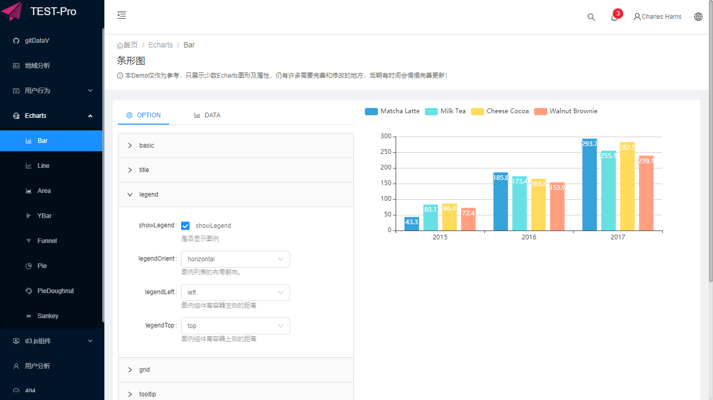
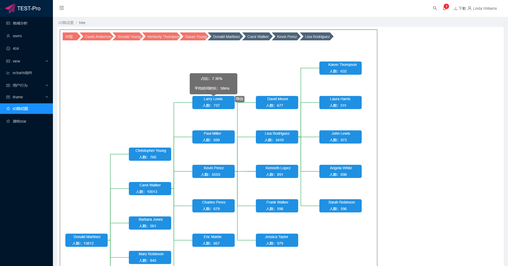

# antd-umi-sys

***如果你喜欢这个项目请给一个⭐，谢谢!***

***Please give me a Star if you like this project.Thank you so much.***

## 简介
    企业系统，数据可视化平台。
    推荐浏览器：Google Chrome
    





> 图形配置在线编辑




## 前端技术栈 
   前端技术栈：react+umi+dva+antd+less
## 特性
+ 单页面应用；
+ 模块化、组件化开发；
+ 结合dva基于 redux 和 redux-saga 的数据流方案；
+ 约定式路由，无需再维护一份冗余的路由配置，支持权限、动态路由、嵌套路由等；
+ 插件化，一键实现按需加载、兼容 ie9 、切换 preact等；
+ 开箱即用，无需安装 react、preact、webpack、react-router、babel、jest 等；
+ 丰富的Echarts图形组件；
+ mock模拟数据请求
---
## 环境准备
1. 首先安装 node，并确保 node 版本是 8 或以上。（mac 下推荐使用 nvm 来管理 node 版本）
        `node -v`
2. 然后全局安装 umi，并确保版本是 2.0.0 或以上。
    - `npm install -g umi (或yarn global add umi)`
    - `umi -v`
3. git地址下载脚手架代码：[antd-umi-sys](https://github.com/mpw0311/antd-umi-sys.git)
    
4. 安装依赖模块：
    `npm install`
5. 启动本地开发：
    `npm start`
6. 打包发布：
    `npm run build`
## 支持区块开发
`npm run add-page` 快速添加一个页面模板,详细请看[block.html](https://umijs.org/zh/guide/block.html)
## 目录结构

```js
├── dist/                               // 默认的 build 输出目录
├── mock/                               // mock 文件所在目录，基于 express
├── node_modules                        // 第三方类库和工具
├── public                              // 公共的文件（此文件夹里的文件不会经过打包工具处理，会原样拷贝过去）
├── config/ 
    ├── config.js                       // umi 配置，同 .umirc.js，二选一
└── src/                                // 源码目录，可选
    ├── assets                          // 公共的文件（如图片，js等此文件夹里的文件会经过webpack打包处理）
    ├── components/                      // 项目组件
    ├── layouts/                        // 全局布局
        ├── main/index.js               // 系统内部布局
        ├── login/index.js              // 登录页布局
    ├── pages/                          // 页面目录，里面的文件即路由
        ├── .umi/                       // dev 临时目录，需添加到 .gitignore
        ├── document.ejs                // HTML 模板
        ├── 404.js                      // 404 页面
        ├── login/                      // 系统登录页面
            ├── index.js                // 登录页ui组件
            ├── index.less              // 组件样式
            ├── components/             
            ├── model.js                // 数据模型
            ├── sevice.js               //  数据接口
        ├── sys/                        // 系统文件夹
            ├── page/                   // 页面 1，任意命名，导出 react 组件
                ├── index.js            // ui组件
                ├── index.less          // 组件样式
                ├── components/         
                    ├── component.js    // 页面组件
                ├── model.js            // 数据模型
                ├── sevice.js           //  数据接口
    ├── utils/                          // 工具函数
    ├── themes/                         // 自定义样式
    ├── global.css                      // 约定的全局样式文件，自动引入，也可以用 global.less
    ├── global.js                       // 可以在这里加入 polyfill
    ├── config.js                       // 系统信息配置
├── .umirc.js                           // umi 配置，同 config/config.js，二选一
├── themes.config.js                    // 主题配置
├── .eslintrc                           // js、jsx、es6(es2015)等代码的检测
├── .env                                // 环境变量
└── package.json
```
## 请关注公众号，会有不定时福利分享（视频资源、优惠券、技术文章等）
