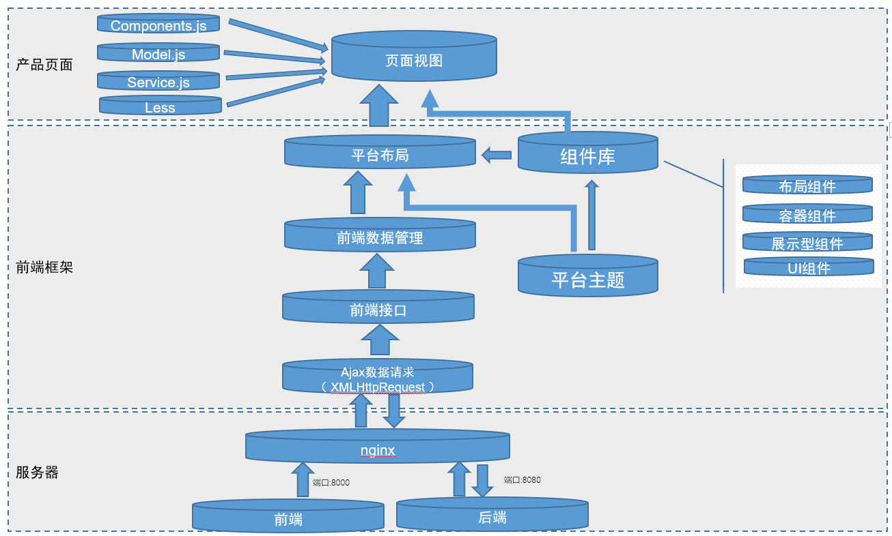

# antd-umi-sys
## 简介
    企业管理平台，主要技术：react、antd、umi、dva、es6、less、webpack等。
    推荐浏览器：Google Chrome


## 特性
+ 单页面应用；
+ 模块化、组件化开发；
+ 结合dva基于 redux 和 redux-saga 的数据流方案；
+ 约定式路由，无需再维护一份冗余的路由配置，支持权限、动态路由、嵌套路由等；
+ 插件化，一键实现按需加载、兼容 ie9 、切换 preact等；
+ 开箱即用，无需安装 react、preact、webpack、react-router、babel、jest 等；
+ 丰富的Echarts图形组件；
+ mock模拟数据请求
---
## 环境准备
    1.首先得有 node，并确保 node 版本是 8 或以上。（mac 下推荐使用 nvm 来管理 node 版本）
        $ node -v
        8.x
    2.然后全局安装 umi，并确保版本是 2.0.0 或以上。
        $ yarn global add umi
        $ umi -v
        2.0.0
    3.git地址下载脚手架代码：
        https://github.com/mpw0311/antd-umi-sys.git
    4.安装依赖模块：
        npm install
    5.启动本地开发：
        npm start
    6.打包发布：
        npm run build

## 目录结构

```js
├── dist/                               // 默认的 build 输出目录
├── mock/                               // mock 文件所在目录，基于 express
├── node_modules                        // 第三方类库和工具
├── public                              // 公共的文件（此文件夹里的文件不会经过打包工具处理，会原样拷贝过去）
├── config/ 
    ├── config.js                       // umi 配置，同 .umirc.js，二选一
└── src/                                // 源码目录，可选
    ├── assets                          // 公共的文件（如图片，js等此文件夹里的文件会经过webpack打包处理）
    ├── components/                      // 项目组件
    ├── layouts/                        // 全局布局
        ├── main/index.js               // 系统内部布局
        ├── login/index.js              // 登录页布局
    ├── pages/                          // 页面目录，里面的文件即路由
        ├── .umi/                       // dev 临时目录，需添加到 .gitignore
        ├── document.ejs                // HTML 模板
        ├── 404.js                      // 404 页面
        ├── login/                      // 系统登录页面
            ├── index.js                // 登录页ui组件
            ├── index.less              // 组件样式
            ├── components/             
            ├── model.js                // 数据模型
            ├── sevice.js               //  数据接口
        ├── sys/                        // 系统文件夹
            ├── page/                   // 页面 1，任意命名，导出 react 组件
                ├── index.js            // ui组件
                ├── index.less          // 组件样式
                ├── components/         
                    ├── component.js    // 页面组件
                ├── model.js            // 数据模型
                ├── sevice.js           //  数据接口
    ├── utils/                          // 工具函数
    ├── themes/                         // 自定义样式
    ├── global.css                      // 约定的全局样式文件，自动引入，也可以用 global.less
    ├── global.js                       // 可以在这里加入 polyfill
    ├── config.js                       // 系统信息配置
├── .umirc.js                           // umi 配置，同 config/config.js，二选一
├── themes.config.js                    // 主题配置
├── .eslintrc                           // js、jsx、es6(es2015)等代码的检测
├── .env                                // 环境变量
└── package.json
```
## 前端架构图

---
## 常用数据模型
### 1.基础数据结构
```json
[
    {
        "name": "直接访问",
        "value": 335
    },
    {
        "name": "邮件营销",
        "value": 310
    },
    {
        "name": "联盟广告",
        "value": 234
    },
    {
        "name": "视频广告",
        "value": 135
    },
    {
        "name": "搜索引擎",
        "value": 400
    },
]
```
### 2.二维表数据结构
```json
    {
    "columns": [
        {
            "field": "xAxis",
            "name": "时间",
            "type": "string"
        },
        {
            "field": "email",
            "name": "邮件营销",
            "type": "string"
        },
        {
            "field": "union",
            "name": "联盟广告",
            "type": "string"
        },
        {
            "field": "video",
            "name": "视频广告",
            "type": "string"
        },
        {
            "field": "visit",
            "name": "直接访问",
            "type": "string"
        },
        {
            "field": "search",
            "name": "搜索引擎",
            "type": "string"
        }
    ],
    "rows": [
        {
            "xAxis": "周一",
            "email": 120,
            "union": 220,
            "video": 150,
            "visit": 30,
            "search": 820
        },
        {
            "xAxis": "周二",
            "email": 132,
            "union": 182,
            "video": 232,
            "visit": 332,
            "search": 932
        },
        {
            "xAxis": "周三",
            "email": 101,
            "union": 192,
            "video": 202,
            "visit": 302,
            "search": 902
        },
        {
            "xAxis": "周四",
            "email": 134,
            "union": 234,
            "video": 154,
            "visit": 334,
            "search": 934
        },
        {
            "xAxis": "周五",
            "email": 90,
            "union": 290,
            "video": 190,
            "visit": 390,
            "search": 1290
        },
        {
            "xAxis": "周六",
            "email": 230,
            "union": 330,
            "video": 330,
            "visit": 330,
            "search": 1230
        },
        {
            "xAxis": "周日",
            "email": 210,
            "union": 310,
            "video": 420,
            "visit": 320,
            "search": 1320
        }
    ]
}
```
### 3.树形结构
```json
[
    {
        "name": "直达",
        "children": [
            { "value": 335, "name": "直达" },
        ]
    },
    {
        "name": "营销广告",
        "children": [
            { "value": 310, "name": "邮件营销" },
            { "value": 234, "name": "联盟广告" },
            { "value": 135, "name": "视频广告" },
        ]
    },
    {
        "name": "搜索引擎",
        "children": [
            { "value": 1048, "name": "百度" },
            { "value": 251, "name": "谷歌" },
            { "value": 147, "name": "必应" },
            { "value": 102, "name": "其他" }
        ]
    },

]
```
```json
    {
        "data":{
            "columns": [
                {
                    "field": "title",
                    "name": "标题名",
                    "type": "string"
                },{
                    "field": "key",
                    "name": "key",
                    "type": "string"
                }
            ],
            "rows": [
                {
                    "title": "首页",
                    "key": "home"
                },{
                    "title": "汇总数据",
                    "key": "huizongshuju",
                    "children": [
                        {
                            "title": "交易",
                            "key": "jiaoyi"
                        },{
                            "title": "用户",
                            "key": "yonghu"
                        },{
                            "title": "存量",
                            "key": "cunliang"
                        }
                    ]
                },
                {
                    "title": "实时分析",
                    "key": "shishifenxi",
                    "children": [
                        {
                            "title": "实时概况",
                            "key": "shsihigaikuang"
                        }
                    ]
                },{
                    "title": "定期数据",
                    "key": "dingqishuju"
                }
            ]
        },
        "status":0
    }
```

## 响应式栅格
```
xs	<576px 响应式栅格，可为栅格数或一个包含其他属性的对象
sm	≥576px 响应式栅格，可为栅格数或一个包含其他属性的对象
md	≥768px 响应式栅格，可为栅格数或一个包含其他属性的对象
lg	≥992px 响应式栅格，可为栅格数或一个包含其他属性的对象
xl	≥1200px 响应式栅格，可为栅格数或一个包含其他属性的对象
xxl	≥1600px 响应式栅格，可为栅格数或一个包含其他属性的对象
```